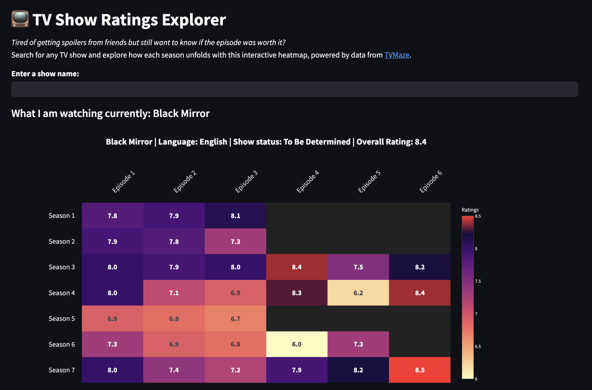

This app lets you explore the highs and lows of your favorite TV shows with a season-by-season breakdown of episode ratings — visualized as an interactive heatmap.

Go visit the [app](https://tvshowratings.streamlit.app/).

Uses the [TVMaze API](https://www.tvmaze.com).

---

## Why I Built This

I built this app to create a fun and intuitive way to visualize how shows evolve over time — not just based on overall ratings, but episode by episode. While platforms like IMDb and Rotten Tomatoes provide summaries, they rarely offer a detailed view of where a show dipped or peaked seasonally — and they often leave you with spoilers.

This tool helps:
- Identify the best and worst seasons at a glance
- Decide whether to keep watching or skip ahead
- Make TV discussions more data-driven (yes, even for *Grey’s Anatomy*)

---

## Run Locally

1. **Clone the repository**
   ```bash
   git clone https://github.com/mekgurnani/tvshow_ratings.git
   cd tvshow_ratings
   ```

2. **Set up virtual environment**
   ```bash
   python -m venv .venv
   source venv/bin/activate
   pip install -r requirements.txt
   ```

3. **Run your own Streamlit app**
   ```bash
   streamlit run streamlit_app_3.0.py
   ```
  
